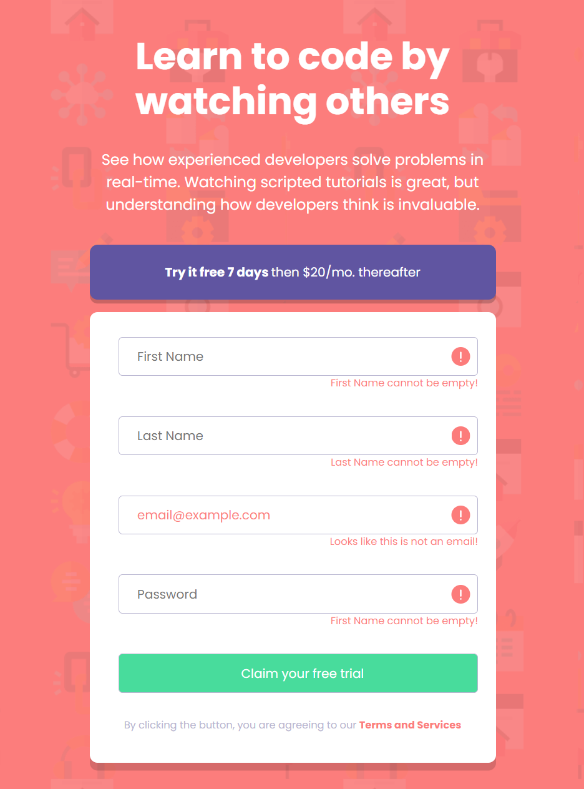
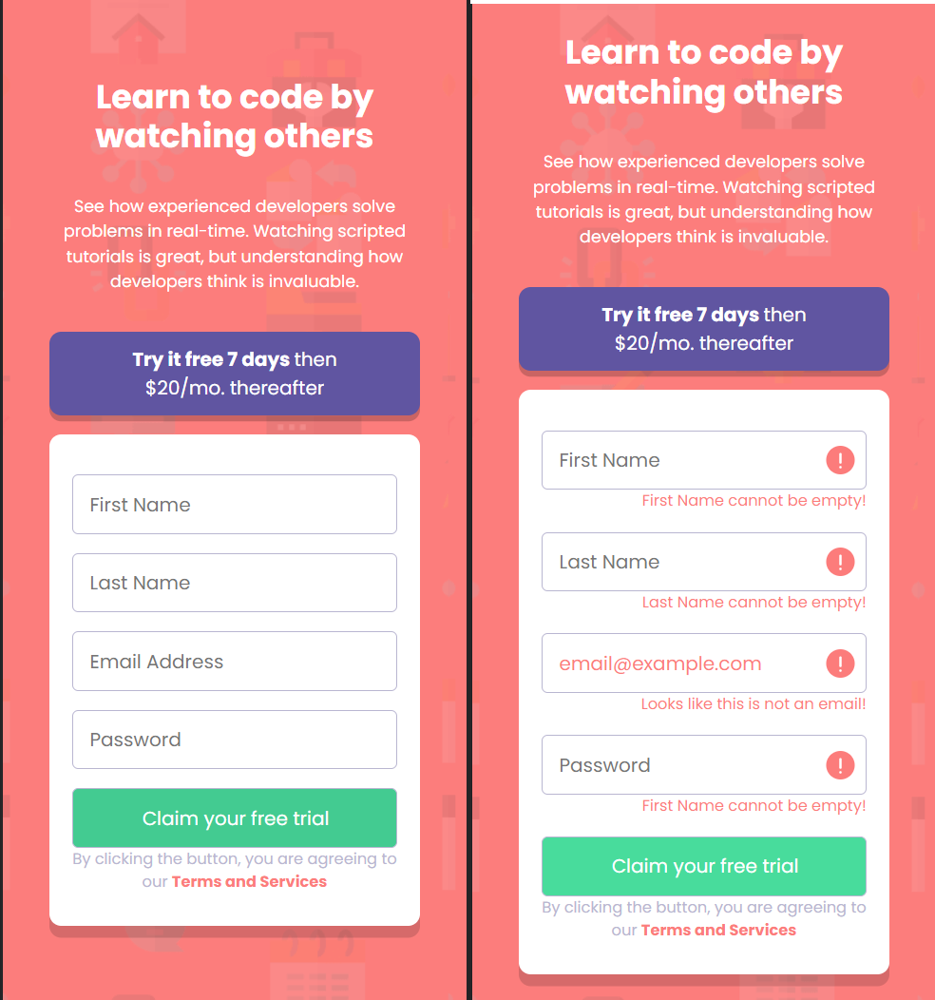

# Frontend Mentor - QR code component solution

This is a solution to the [QR code component challenge on Frontend Mentor](https://www.frontendmentor.io/challenges/qr-code-component-iux_sIO_H). Frontend Mentor challenges help you improve your coding skills by building realistic projects. 

## Table of contents

- [Overview](#overview)
  - [Screenshot](#screenshot)
  - [Links](#links)
- [My process](#my-process)
  - [Built with](#built-with)
  - [What I learned](#what-i-learned)
  - [Continued development](#continued-development)
- [Author](#author)
- [Acknowledgments](#acknowledgments)

## Overview

### Screenshot
- Desktop view

- Tablet View

- Mobile View

### Links

- Solution URL: https://github.com/mrxshinji/FE_Mentor-Interactive-rating-component
- Live Site URL: https://mrxshinji.github.io/FE_Mentor-Interactive-rating-component/

## My process

### Built with

- Semantic HTML5 markup
- Flexbox
- CSS Grid
- Mobile-first workflow

### What I learned

Sign-in component with warnings. Lots of styling practiced

### Continued development

CSS styling felt immature as i have to keep refactoring element with bootstrap Grid System for better responsiveness

### Useful resources

- [https://stackoverflow.com/] - Provide alot of insight on centering item.
- [https://www.w3schools.com/] - Provide alot help on syntax and how to use each method

## Author

- Website - [https://github.com/mrxshinji]
- Frontend Mentor - [@mrxshinji](https://www.frontendmentor.io/profile/mrxshinji)

## Acknowledgments

[Email Regex solution](https://stackoverflow.com/questions/46155/how-can-i-validate-an-email-address-in-javascript) - a strict regex solution

